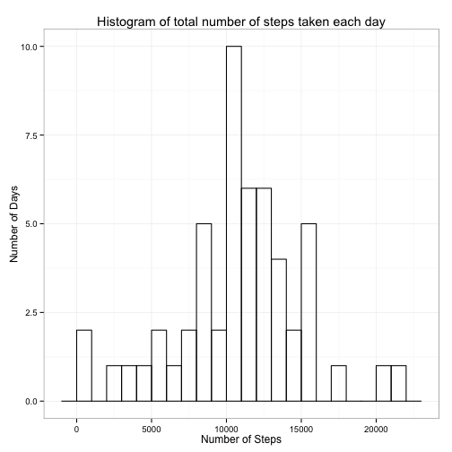
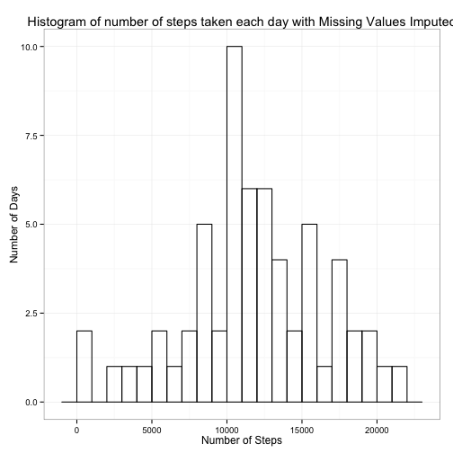
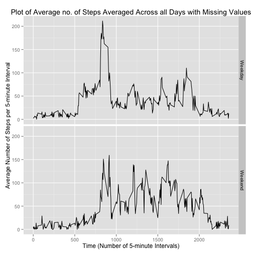

# Reproducible Research: Peer Assessment 1

This Rmd document describes in detail, the procedures involved (with R code) to complete the 1st Peer assessment of the course Reproducible Research.

For this code to work, the required CSV file ("activity.csv") is assumed to be unzipped and placed in the current working directory.

## Loading and preprocessing the data
The data is loaded with the read.csv command. The only preprocessing done at this stage is to transform the date field from factor type to date type.The code for the same is given below -


```r
act <- read.csv("activity.csv", header = T)
act[, 2] <- as.Date(act[, 2])
```


## What is mean total number of steps taken per day?
This step is to find the mean and median number of steps taken every day. For this analysis, a data frame with the sum of number of steps taken for each day is made as follows - 


```r
summ <- aggregate(act$step ~ act$date, sum, data = act)
```


The ggplot2 system is used to make a histogram of the number of steps grouped by each individual date. The plot obtaied is as follows - 


```r
library(ggplot2)
ggplot(summ, aes(summ[, 2])) + geom_histogram(binwidth = 1000, fill = NA, color = "black") + 
    theme_bw() + xlab("Number of Steps") + ylab("Number of Days") + labs(title = "Histogram of total number of steps taken each day")
```

 


The code to calculate the mean and median values - 


```r
options(scipen = 3)
avg <- round(mean(summ[, 2]), 2)
mdn <- round(median(summ[, 2]), 2)
```


***The mean is found to be 10766.19 and the median 10765.***

## What is the average daily activity pattern?
In order to find the daily activity pattern, a data frame with the average number of steps taken for each 5-minute interval averaged over each day is created -


```r
library(reshape2)
new <- act[complete.cases(act), c(1, 3)]
new$interval <- as.factor(new$interval)
summ1 <- acast(melt(new, id = "interval"), interval ~ variable, mean)
summ2 <- data.frame(cbind(as.numeric(rownames(summ1)), as.numeric(summ1[, 1])))
maxavg <- subset(summ2, summ2[, 2] == max(summ2[, 2]), select = X1)
```

From this dataset, the required plot is generated - 


```r
plot(summ2[, 1], summ2[, 2], xlim = c(0, 2500), type = "l", main = "Time Series Plot of Average Number of Steps Averaged Across All Days", 
    xlab = "Time (Number of 5-minute Intervals)", ylab = "Average Number of Steps per 5-minute Interval")
```

 


***The 5-minute interval for which the average steps taken is maximum is found to be 835***

## Imputing missing values
The missing values are dealt with in this section. The total number of complete rows is calculated with the following -


```r
sumcomp <- sum(is.na(act[, 1]))
```


***The number of rows in the original data set with NA values (missing values) is found to be 2304.***

The missing values are imputed by using the **Amelia Package**. (Please run install.packages("Amelia") if not installed)
The Amelia package is used as it offers many advantages over other methods of missing value imputation. It implements a rigorous Expectation maximization Bootstrapping algorithm to provide results quickly.

The reasoning for not using mean/median imputation as suggested by the Assignment instructions is expressed well in the documentation -
- Amelia II performs multiple imputation, a general-purpose approach to data with missing values. 
- Multiple imputation has been shown to reduce bias and increase efficiency compared to listwise deletion. 
- Furthermore, ad-hoc methods of imputation, such as **mean imputation, can lead to serious biases in variances and covariances**.

Thus, in order to fill in the missing values quickly and in a logical manner, the Amelia package is used as follows. A data frame with the sum of number of steps taken for each day is made as follows for imputed dataset -


```r
library(Amelia)
imps <- amelia(act, m = 3, idvars = 2, ords = 1)
imp <- imps$imputations[[3]]
sumimp <- aggregate(imp$step ~ imp$date, sum, data = imp)
```


The ggplot2 system is used to make a histogram of the number of steps grouped by each individual date from the imputed dataset. The plot obtaied is as follows -


```r
library(ggplot2)
ggplot(sumimp, aes(sumimp[, 2])) + geom_histogram(binwidth = 1000, fill = NA, 
    color = "black") + theme_bw() + xlab("Number of Steps") + ylab("Number of Days") + 
    labs(title = "Histogram of number of steps taken each day with Missing Values Imputed")
```

 


The code to calculate the mean and median values of the imputed dataset - 


```r
options(scipen = 3)
mni <- round(mean(sumimp[, 2]), 2)
mdi <- round(median(sumimp[, 2]), 2)
```


***The mean is found to be 11721.56 and the median 11458 for the dataset with imputed missing values.***

The code to calculate the percentage difference between the two approaches is shown below -


```r
diff1 <- ((mean(sumimp[, 2]) - mean(summ[, 2]))/mean(summ[, 2])) * 100
diff2 <- ((median(sumimp[, 2]) - median(summ[, 2]))/median(summ[, 2])) * 100
```


The mean of the data obtained by removing the NA values is found to be ***8.8738% less*** than the mean calculated by imputing data through the amelia package.  
Similarly, The median of the data obtained by removing the NA values is found to be ***6.4375%*** less than the median calculated by imputing data through the amelia package.  
As observed, the decision to leave or imput the missing values has a small impact on the dataset (less than 10% change).

## Are there differences in activity patterns between weekdays and weekends?
In order to analyze the difference between activity patterns on weekends and weekdays, a suitable data frame with a factor variable (indicating if a day is a weekend or weekday) is added to the dataset with imputed missing values. For the purpose of this analysis, weekend is assumed to be only "Sunday" and "Saturday" -


```r
imp1 <- cbind(imp, weekdays(imp$date))
imp1[, 4] <- as.character(imp1[, 4])

for (i in 1:length(imp1$steps)) {
    if (imp1[i, 4] %in% c("Sunday", "Saturday")) {
        imp1[i, 4] <- "Weekend"
    } else {
        imp1[i, 4] <- "Weekday"
    }
}

imp1[, 4] <- as.factor(imp1[, 4])
colnames(imp1)[4] <- "day"
```


Then, in order to find the average daily activity pattern for the imputed data, a data frame with the average steps taken for each interval averaged over each day is created for the imputed data set - 


```r
library(reshape2)
imp1$interval <- as.factor(imp1$interval)
fin <- tapply(imp1[, 1], list(imp1[, 4], imp1[, 3]), mean)
finm <- melt(fin)
```


The ggplot2 system is used to make a panel plot of the average number of steps grouped by 5-minute interval for weekkdays and weekends with the imputed data - 


```r
library(ggplot2)
ggplot(finm, aes(Var2, value)) + geom_line() + facet_grid(Var1 ~ .) + xlab("Time (Number of 5-minute Intervals)") + 
    ylab("Average Number of Steps per 5-minute Interval") + labs(title = "Plot of Average no. of Steps Averaged Across all Days with Missing Values")
```

 


It can be concluded from the above plot, that the average number of steps taken during the weekends is noticeably lesser than the average number of steps taken during weekdays.
